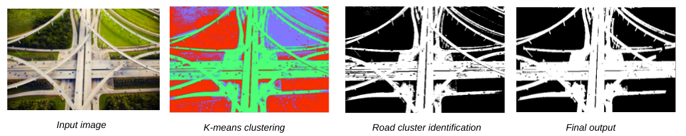

## Road Extraction :</br>

This repository contains code for the paper [Road extraction using K-Means clustering and morphological operations](https://scholar.google.com/scholar?hl=en&as_sdt=0%2C5&q=Road+extraction+using+K-Means+clustering+and+morphological+operations&btnG=) implemented as a project submission for the `Digital Image Processing` course offered in Monsoon 2021.

# Road Extraction Using K-Means Clustering and Morphological Operations



The steps followed to obtained the road extracted image: 
 1) K-Means Clustering: The pixels are clustered according to their intensities. 

 2) Road Cluster Identification: Road clusters are identified from the cluters obtained. The cluster which has the longest component is choosen as the road cluster. 

 3) Road Cluster Filtering: Dilation and non-road area removal is performed. 

 4) Result Evaluation: The performance of the resultant image is evaluated by parameters like: completeness, correctness, and quality. 

## Code Structure

The code is structured as follows:

```


├── README.md
├── guidlines.md
├── Code
│   ├── K_means.ipynb
│   ├── image_dilation_and_erosion.ipynb
│   ├── reference_image.ipynb
│   ├── testing.ipynb
│   |──Road_Cluster_Identification_and__Filtering.ipynb
├── documents
│   |── proposal.pdf
│   ├── final-eval.pdf
├── images
├── demo.ipynb
|── main.py
└── src
    ├── __init__.py
    ├── Kmeans-clustering.py
    ├── road-cluster-identification.py
    └── road-cluster-filtering.py
    └── result-evaluation.py

```

In the above structure, the source code for the whole implementation can be found in the `code` directory.

## Run Demo

### Pre-requisites

Before running the demo, make sure that the following python libraries are installed and working well. 

```
numpy
opencv-python
Matplotlib
wxPython
PIL
```

### Data

The sample images on which we ran our code, and the corresponding output images can be found here.

We collected these images from Google Maps and using drone. The reference images for result evaluation were created using Adobe Photoshop and thresholded using python.

### Running the demo
The main.py script in the repository is the main script which can be used to run the demo. The instructions to run the script is:

The interactive UI is generated where you can Open the image of a road network, for which you want to extract the roads.
Click Run to see the output.
If the output image is not satisfactory, the non-road regions which came up as road in the output can be removed. You can select non-road regions by clicking Mark non-road' and moving the curser over the required region, while left clicking. Click Run` again to get the output.
The output will be generated and displayed on the output screen in a few seconds. The result evaluation based on our data is shown in another output screen/pop-up.
Conclusion and Result Evaluation
Each input road-network image is compared with a carefully curated reference image of the road network.
